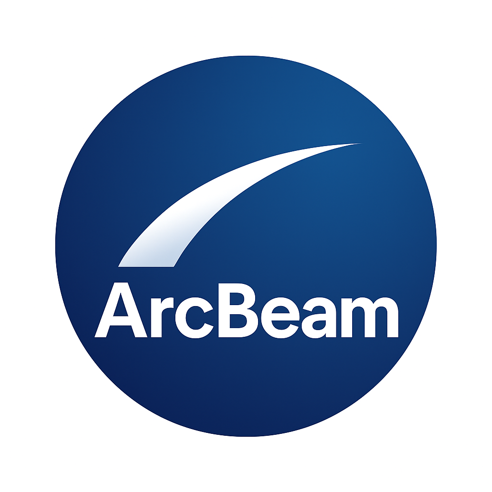
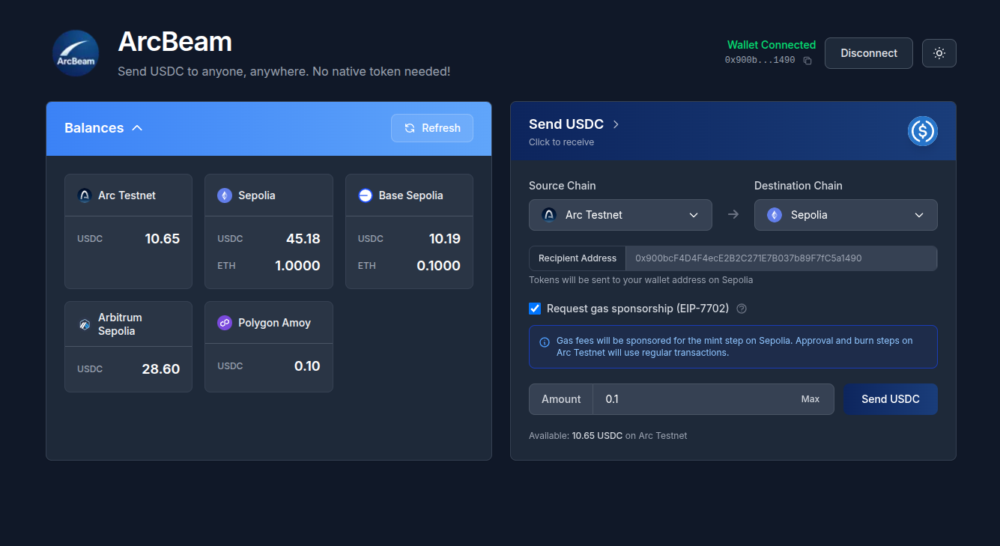
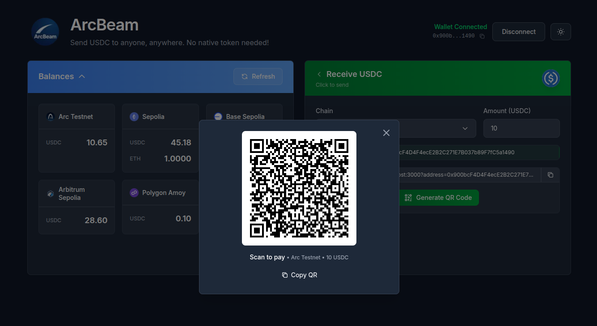

# ArcBeam




**Send USDC to anyone, anywhere. No native token needed!**

ArcBeam is a cross-chain USDC bridge application that enables seamless transfers of USDC between multiple blockchain networks without requiring users to hold native tokens for gas fees. ArcBeam leverages Circle's Bridge Kit, Privy's embedded wallet with gas sponsorship, and EIP-7702 authorization to deliver a frictionless cross-chain payment experience where no native token is needed. USDC is all you'll need!




## Features

- **Gasless Cross-Chain Transfers**: Bridge USDC across chains without holding native tokens, powered by Privy's native gas sponsorship
- **Multi-Chain Support**: Transfer USDC between Arc Testnet, Ethereum Sepolia, Base Sepolia, Arbitrum Sepolia, Optimism Sepolia, Polygon Amoy, Ink Testnet, and more
- **Embedded Wallet**: Automatic wallet creation via Privy with no popups or external wallet requirements
- **EIP-7702 Support**: Advanced transaction authorization for enhanced gasless operations
- **Payment Requests**: Generate shareable payment links and QR codes for receiving USDC on any supported chain
- **Unified Balance View**: View your USDC balances across all supported chains in one place
- **Real-Time Bridge Progress**: Track your cross-chain transfers with detailed step-by-step progress indicators

## How It Works

ArcBeam uses Circle's Cross-Chain Transfer Protocol (CCTP) via the Bridge Kit to enable secure USDC transfers:

1. **User initiates transfer**: Select amount, source chain, and destination chain
2. **Gasless approval**: Privy sponsors the gas for token approval (if needed)
3. **Bridge execution**: USDC is burned on the source chain via Circle's TokenMessenger
4. **Cross-chain mint**: Circle's infrastructure mints USDC on the destination chain
5. **Completion**: Recipient receives USDC on their chosen chain

The entire process is gasless for users thanks to Privy's embedded wallet and gas sponsorship system, making it accessible even for users new to Web3. As long you can login using familiar Web2 interfaces into Privy, you're sorted out to send and receive USDC.

## Tech Stack

- **Frontend**: Next.js 16, React 19, TypeScript, Tailwind CSS
- **Wallet & Auth**: Privy (embedded wallet, gas sponsorship)
- **Blockchain**: viem, wagmi, ethers.js
- **Bridge Protocol**: Circle Bridge Kit (CCTP)
- **Advanced Features**: EIP-7702 authorization, Permissionless.js

## Getting Started

### Prerequisites

- Node.js 18+
- npm, yarn, pnpm, or bun

### Installation

```bash
npm install
```

### Environment Variables

Create a `.env.local` file with the following variables:

```env
NEXT_PUBLIC_PRIVY_APP_ID=your_privy_app_id
NEXT_PUBLIC_PRIVY_CLIENT_ID=your_privy_client_id
NEXT_PUBLIC_PIMLICO_API_KEY=your_pimlico_api_key
NEXT_PUBLIC_SPONSORSHIP_POLICY_ID=your_pimlico_sponsorship_policy_id
```

### Run Development Server

```bash
npm run dev
```

Open [http://localhost:3000](http://localhost:3000) with your browser to see the result.

## Supported Chains

- Arc Testnet
- Ethereum Sepolia
- Base Sepolia
- Arbitrum Sepolia
- Optimism Sepolia
- Polygon Amoy
- Ink Testnet

More chains can be added as long as they're supported by [CCTP](https://developers.circle.com/cctp/cctp-supported-blockchains).

## Learn More

- [Circle Bridge Kit](https://developers.circle.com/bridge-kit)
- [Privy Documentation](https://docs.privy.io)
- [EIP-7702 Specification](https://eips.ethereum.org/EIPS/eip-7702)
- [CCTP Supported Chains](https://developers.circle.com/cctp/cctp-supported-blockchains)

## License

This project was hacked as part of ETHGlobal Buenos Aires 2025 hackathon.
